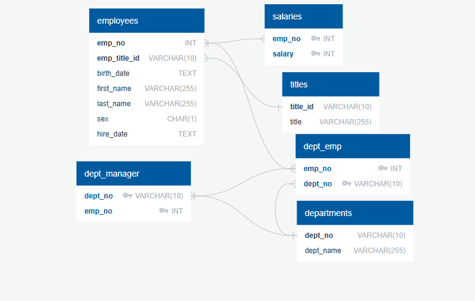

# Pewlett Hackard Employee Database Project

## Overview
This project presents a complete data engineering and analysis pipeline for a fictional company, Pewlett Hackard. The goal was to reconstruct a historical employee database from flat files and extract actionable business insights using SQL.

The project includes data modeling, database schema creation, data ingestion from CSV files, and SQL-based analysis. It demonstrates proficiency in SQL, relational database design, and analytical thinking.

---

## 📁 Project Structure
```
sql-challenge/
├── EmployeeSQL/
│   ├── data/                    # Raw CSV files
│   ├── queries.sql              # Analysis SQL queries
│   ├── table_schemas.sql        # Table creation scripts
│   ├── erd.png                  # Entity Relationship Diagram
│   └── README.md                # Project documentation
```

---

## 🧱 Data Modeling
- Designed and implemented a normalized relational schema for six related datasets.
- Constructed an Entity Relationship Diagram (ERD) to define primary keys, foreign keys, and table relationships.


### Tables Created
- `departments`
- `dept_emp`
- `dept_manager`
- `employees`
- `salaries`
- `titles`

---

## ⚙️ Data Engineering
- Defined and created all tables in PostgreSQL with accurate data types, constraints, and referential integrity.
- Applied `NOT NULL` constraints and appropriate `VARCHAR` lengths for clarity and performance.
- Imported structured data from CSV files into SQL tables.

---

## 🔎 Data Analysis
Executed a series of SQL queries to explore and analyze the dataset. Highlights include:

- Listing employee details including salary.
- Identifying employees hired in 1986.
- Finding department managers and their information.
- Exploring department assignments for all employees.
- Filtering by employee name patterns (e.g., Hercules, last names starting with 'B').
- Isolating employees in Sales and Development departments.
- Counting most common last names among employees.

Each query was optimized to extract meaningful insights while demonstrating SQL proficiency and business reasoning.

---

## 🧰 Technologies Used
- PostgreSQL
- pgAdmin / psql CLI
- QuickDBD for ERD modeling
- Git & GitHub for version control

---

## 📌 Key Skills Demonstrated
- SQL scripting and query optimization
- Relational database design
- Data cleaning and ingestion
- Analytical problem-solving

---

## 📎 Resources
- [PostgreSQL Documentation](https://www.postgresql.org/docs/)
- [QuickDBD](https://www.quickdatabasediagrams.com)

---

